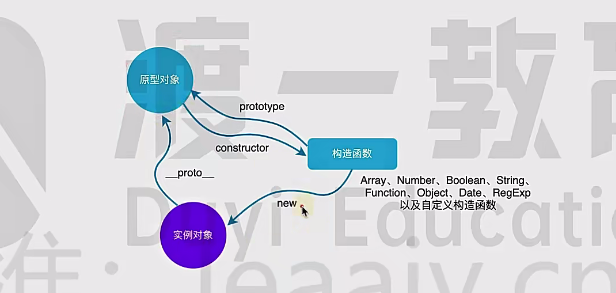
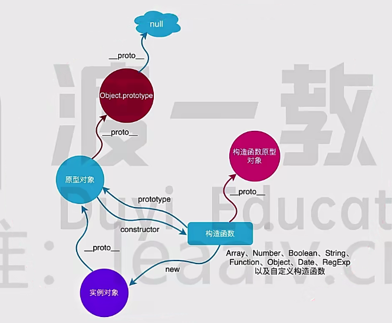
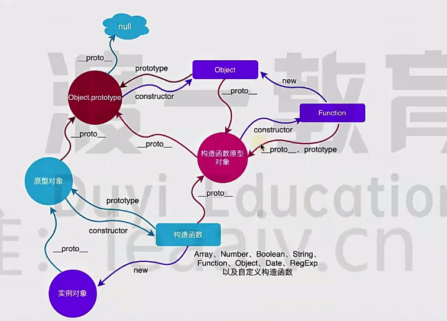

# 原型

```js
var person = {
  arms: 2,
  legs: 1,
};
/**
 * Object.create 第一个参数时原型对象
 * Object.create 第二个参数: 对象
 * 该对象里面可以设置多个键值对
 * 每个键就是新对象的属性，所对应的值是一个属性描述符
 */
var zhangSan = Object.create(person);
console.log(zhangSan.arms); // 2
console.log(zhangSan.legs); // 1
console.log(zhangSan); // {}
console.log(zhangSan.__proto__); // {arms: 2, legs: 1}
person.arms = 3;
console.log(zhangSan.arms); // 3
```

```js
var person = {
  arms: 2,
  legs: 1,
};
var zhangSan = Object.create(person, {
  name: {
    value: "张三",
    enumerable: true, // 是否可以枚举, 默认为false
  },
  age: {
    value: 18,
    enumerable: true,
  },
  legs: {
    value: 5,
    enumerable: false,
  },
});
console.log(zhangSan); // {name: "张三", age: 18}
console.log(zhangSan.arms); // 2
console.log(zhangSan.legs); // 5
console.log(person.legs); // 1

console.log(zhangSan.__proto__ === person);
```

当查找一个对象属性时，如果对象没有这个属性，则会去对象的原型对象上去找

之后，随 js 发展，希望通过类来批量生产对象
早期 js 通过构造函数来模拟其他语言中的类

```js
function Computer(name, price) {
  this.name = name;
  this.price = price;
  this.showPrice = function () {
    console.log(this.price);
  };
}

var apple = new Computer("mac", 10000);
console.log(apple);
apple.showPrice();
```

只是模拟,但是在底层还是基于原型来创建的对象

```js
function Computer(name, price) {
  this.name = name;
  this.price = price;
}

Computer.prototype.showPrice = function () {
  console.log(this.price);
};

var apple = new Computer("mac", 10000);
console.log(apple); // Computer { name: 'mac', price: 10000 }
apple.showPrice(); // 10000
console.log(apple.__proto__ === Computer.prototype); // true
console.log(apple.constructor === Computer); // true
```



内置的构造函数也有同样的三角关系

```js
var arr = [];
console.log(arr.__proto__ === Array.prototype); // true
```





## 真题解答

### 说一说 JavaScript 中原型和原型链的理解？

- 每个对象有一个**proto**属性，该属性指向自己的原型对象
- 每个构造函数中有一个 prototype 属性，该属性指向实例对象的原型对象
- 原型对象里的 constructor 指向构造函数本身

每个对象都有自己的原型对象，而原型对象本身，也有自己的原型对象，从而形成了一条原型链条

### 对一个构造函数实例化后，它的原型链指向什么

指向该构造函数实例化的原型对象  
对于构造函数来说，可以通过 prototype 访问到该对象  
对于实例对象来讲，可以通过**proto**访问到该对象
