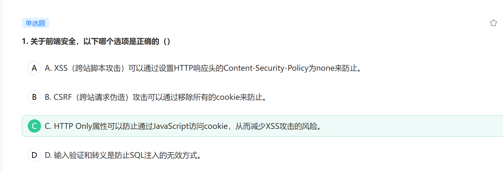
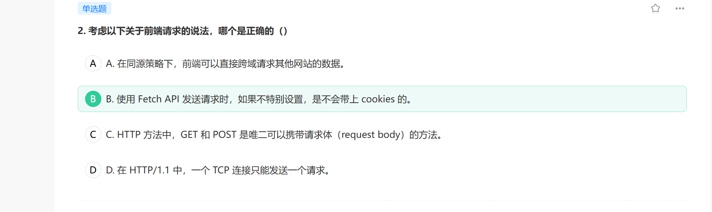
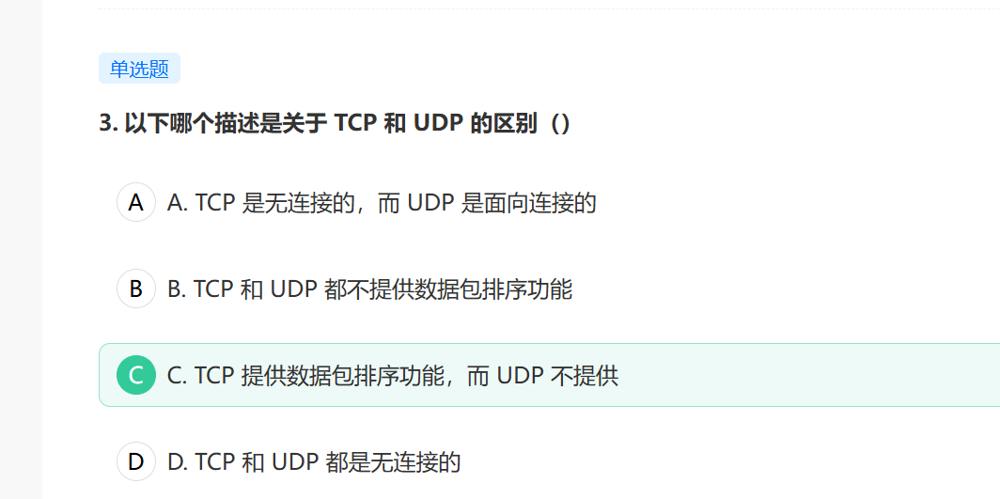
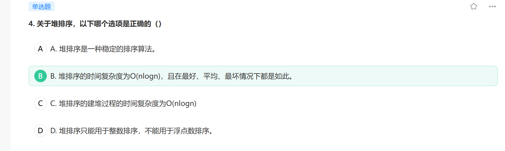

1.  关于前端安全，以下哪个选项是正确的（）
    A
    A. XSS（跨站脚本攻击）可以通过设置 HTTP 响应头的 Content-Security-Policy 为 none 来防止。
    B
    B. CSRF（跨站请求伪造）攻击可以通过移除所有的 cookie 来防止。
    C
    C. HTTP Only 属性可以防止通过 JavaScript 访问 cookie，从而减少 XSS 攻击的风险。
    D
    D. 输入验证和转义是防止 SQL 注入的无效方式。
    官方解析：选项 C 是正确的。设置 cookie 的 HTTP Only 属性，可以防止 JavaScript 访问 cookie，从而减少 XSS 攻击的风险。这是因为 XSS 攻击往往会尝试通过 JavaScript 来窃取用户的 cookie 信息。 其他选项都是错误的： A. Content-Security-Policy 不能设置为 none 来防止 XSS 攻击，实际上，Content-Security-Policy 可以设置一些策略，例如限制加载的资源类型和来源，以防止 XSS 攻击。 B. 移除所有的 cookie 并不能防止 CSRF 攻击。防止 CSRF 攻击的常见方式包括使用 CSRF Token，或者验证 Referer 和 Origin 头。 D. 输入验证和转义是防止 SQL 注入的有效方式，而不是无效方式。通过验证输入的数据是否符合预期的格式，以及转义可能会被解释为 SQL 命令部分的输入，可以有效防止 SQL 注入攻击。

2.  考虑以下关于前端请求的说法，哪个是正确的（）
    A
    A. 在同源策略下，前端可以直接跨域请求其他网站的数据。
    B
    B. 使用 Fetch API 发送请求时，如果不特别设置，是不会带上 cookies 的。
    C
    C. HTTP 方法中，GET 和 POST 是唯二可以携带请求体（request body）的方法。
    D
    D. 在 HTTP/1.1 中，一个 TCP 连接只能发送一个请求。
    官方解析：A 选项，同源策略是一种约定，它是浏览器为了防止来自不同源的恶意脚本对网站进行攻击而采取的一种安全策略。在同源策略下，一个网页不能直接请求另一个源的数据，需要通过 CORS 或 JSONP 等方式进行跨域请求，所以 A 选项错误。 B 选项，Fetch API 是一种现代的、强大的请求工具，它可以用来发送各种 HTTP 请求。但是，Fetch API 在默认情况下不会自动发送 cookies，除非你设置了 credentials 选项为 "include"，所以 B 选项正确。 C 选项，虽然 GET 和 POST 是最常用的两种 HTTP 方法，但它们并不是唯二可以携带请求体的方法。例如，PUT 和 DELETE 方法也可以携带请求体，所以 C 选项错误。 D 选项，HTTP/1.1 支持持久连接（persistent connection），也就是说，在一个 TCP 连接上可以发送多个请求和接收多个响应，所以 D 选项错误。

3.  以下哪个描述是关于 TCP 和 UDP 的区别（）
    A
    A. TCP 是无连接的，而 UDP 是面向连接的
    B
    B. TCP 和 UDP 都不提供数据包排序功能
    C
    C. TCP 提供数据包排序功能，而 UDP 不提供
    D
    D. TCP 和 UDP 都是无连接的
    正确答案：C
    官方解析：TCP（传输控制协议）和 UDP（用户数据报协议）是两种常用的互联网协议，它们在数据传输方面有着显著的不同。 TCP 是面向连接的协议，意味着在数据传输之前，发送端和接收端需要建立一个连接。一旦连接建立，数据就可以在两个点之间双向传输。TCP 还提供了错误检查和修正功能，确保数据的完整性和可靠性。此外，TCP 还有一个重要的特性，即数据包排序，它能保证数据包按照发送的顺序到达接收端。 相对于 TCP，UDP 是无连接的协议，它不需要在发送数据之前建立连接。UDP 对于那些不需要所有数据包都达到目的地的应用来说，是一个理想的选择，比如音频和视频流。因为 UDP 不提供错误检查和修正功能，所以它的传输速度通常比 TCP 快。然而，UDP 不提供数据包排序功能，这意味着数据包可能会乱序到达接收端。 所以选项 C 是正确的，TCP 提供数据包排序功能，而 UDP 不提供。

4.  关于堆排序，以下哪个选项是正确的（）
    A
    A. 堆排序是一种稳定的排序算法。
    B
    B. 堆排序的时间复杂度为 O(nlogn)，且在最好、平均、最坏情况下都是如此。
    C
    C. 堆排序的建堆过程的时间复杂度为 O(nlogn)
    D
    D. 堆排序只能用于整数排序，不能用于浮点数排序。
    正确答案：B
    官方解析：选项 B 是正确的。无论在最好、最坏还是平均情况下，堆排序的时间复杂度都是 O(nlogn)。这是因为堆排序的主要步骤是构建堆和调整堆，这两个步骤的时间复杂度都是 O(nlogn)。 其他选项都是错误的： A. 堆排序是一种不稳定的排序算法。在堆排序过程中，存在元素的跳跃式交换，可能会导致相同元素的原有顺序被打乱，所以它是不稳定的。 C. 堆排序的建堆过程的时间代价是 O(n)的，对于堆不同深度的节点，需要比较的次数是不同的，O(n)结果的得出需要数学推导。 D. 堆排序可以用于任何可以比较的数据类型排序，包括浮点数，不仅限于整数排序。
